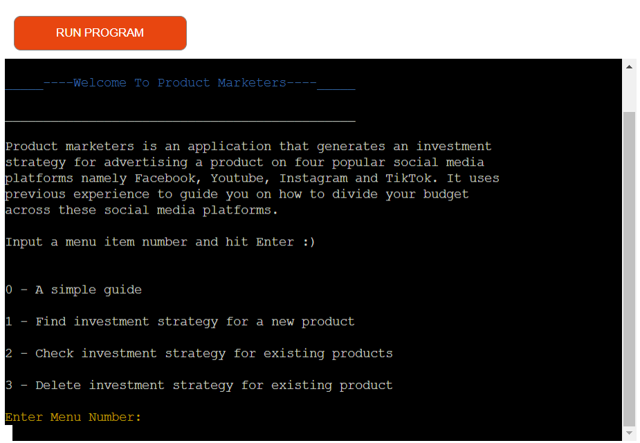
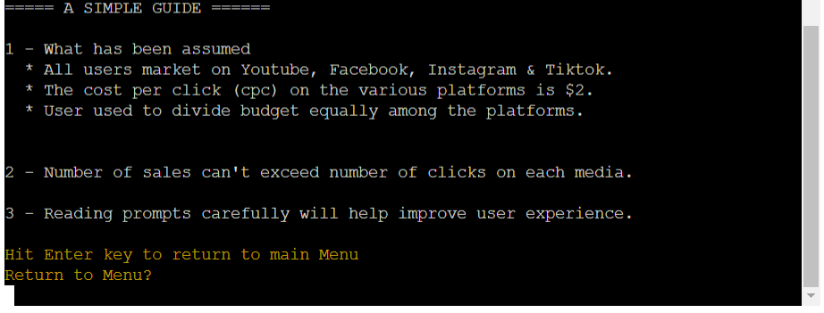
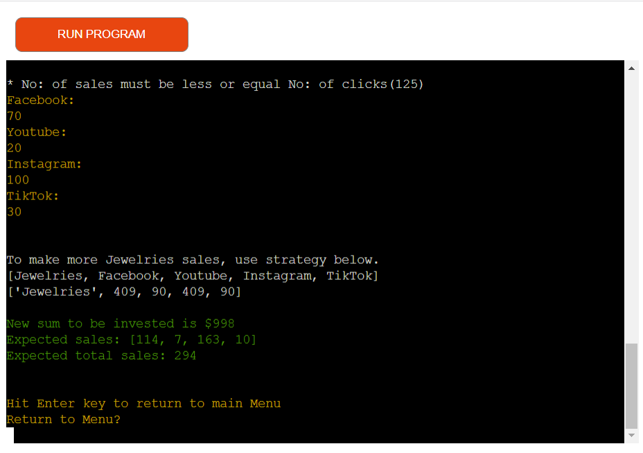
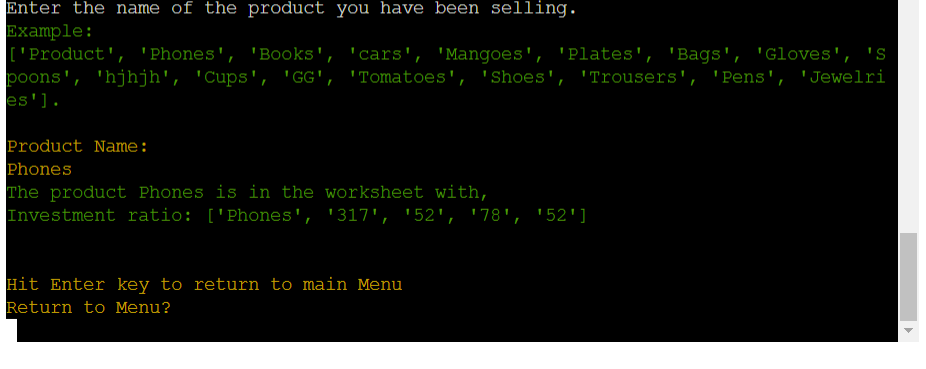
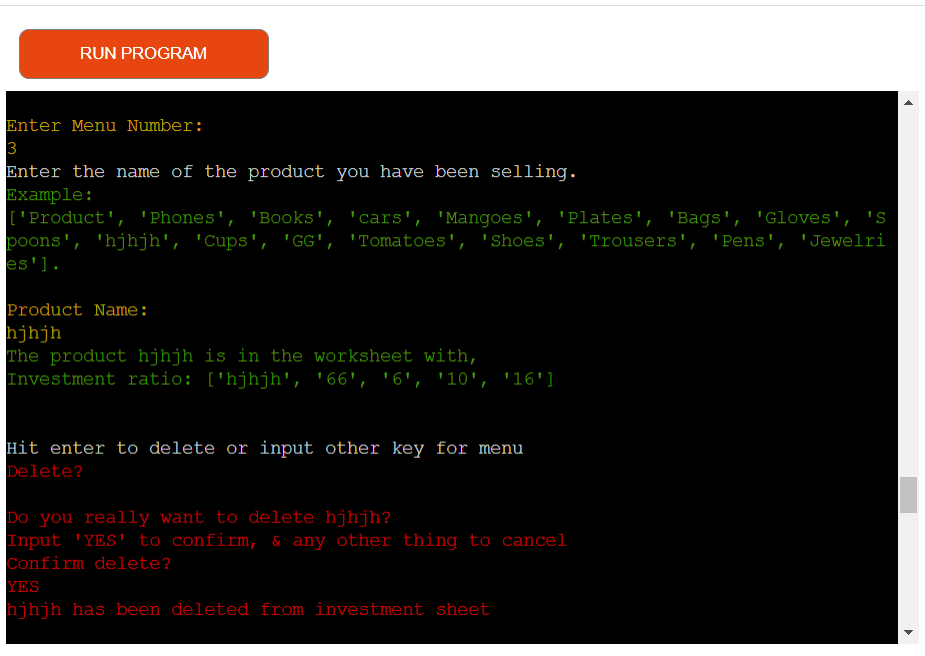

# Product Marketers

Live URL: [Product Marketers](https://product-marketers-65388db1c310.herokuapp.com/)

Product marketers is designed to improve investment strategies for social media marketing companies or individuals who frequently advertise products on social media platforms like Facebook, Youtube, Instagram and Tiktok. Users will be able to improve investment strategy for each product and understand that some products sell better on some platforms than others. In case a new user sells thesame product as an old user, the new user is able to get an investment strategy and start his/her marketing immediatly with the strategy. Thus starting above average and saving some money. A user is also able to delete a product-investment strategy. It is assumed that before using this application, the user usually divides his budget into four equal halves for the different platforms. We also assume that the cost per click here is $2. This application is designed in Python and runs through a terminal.

## Project Goals

### User Goals
- The user wants to improve social media sales of a product by better investing the budget he has and not just dividing the budget equally accross four social media platforms.
- The user also wants to be able to check investment strategies for already registered products and also able to delete some product investment strategies from a saved word sheet.

### Site Owner Goals
- The site owner through the application, wants to collect data from user then then analyse and provide that data with an investment strategy for social media marketing.
- The site owner also wants to provide new users with the option to get existing investment strategies if they sell same products like old users.
- The site owner wants the user to be able to delete old strategies and free up some space.

## Design
Lucid Chart was used to design the flow of this program. It runs through a terminal so the display is thesame on every device.

## Technologies Used

- Languages

    - Python Programming Language

- Tools

    - Codeanywhere
    - Google spreadsheets
    - Lucid Charts
    - Heroku
    - Git
    - Github
    - CI Python Linter

- Libraries
    - gspread
    - openpyxl
    - colorama
    - google.oauth2

## Existing Features
- Start Menu

Once the user runs the program an ordered menu will be displayed. This menu shows the various things that a user can do with this application. By selecting one of the and hitting enter the user will then get the required results.

- A simple Guide

The user can better understand how the application woks after reading this guide. It also tells the user what has been assumed to bring out the results.

- Find investment strategy for new product

To get a strategy to market a new product, user selects menu 1 and then inputs the data as prompted. Then at the end the application provides the user with a new marketing strategy.

- Check investment strategy for existing product

A user can always come back to verify that the strategy they are using is actually the strategy provided by the application. They just need to select 2 and enter the product name as prompted.

- Delete investment strategy for existing product

In case a user no longer sells a product, they can always delete it to free up some space. After deleting the user is notified as shown below.

## Testing

- PEP8 CI Python Linter
No erros found in our code as show below.

- In the table below we present a couple of manual test actions carried out with valid and invalid input, expected out comes and resutls. 

<table>
<tr>
<th>Action</td>
<th>Expected Results</td>
<th>Actual Results</td>
</tr>
<tr>
<td>Hit enter without selecting a menu item or enter a menu item that is invalid and hit enter</td>
<td>User is notified that the input is invalid and given another chance to enter a menu item</td>
<td>Pass</td>
</tr>
<tr>
<td>Enter menu number 0 and hit enter key</td>
<td>A simple guide on how the application works is displayed</td>
<td>Pass</td>
</tr>
<tr>
<td>Enter menu number 1 and hit enter key </td>
<td>Application prompts user to enter a product name, budget, and previous average sales. Then calculates and displays investment strategy for that product.</td>
<td>Pass</td>
</tr>
<tr>
<td>User selects menu 1 and enters a product name that already exist.</td>
<td>The application finds the investment strategy for that product and displays to the user.</td>
<td>Pass</td>
</tr>
<tr>
<td>Enter menu number 2 and hit enter.</td>
<td>Application prompts user to enter a product name, then finds the investment strategy from the investment strategy worksheet and displays it</td>
<td>Pass</td>
</tr>
<tr>
<td>User selects menu number 2 and enters a product that does not exist in the investment strategy worksheet</td>
<td>Application tells user that the product does not exist in works sheet the proposes to create a new investment strategy for the product</td>
<td>Pass</td>
</tr>
<tr>
<td>Enter menu number 3 and hit enter</td>
<td>Application prompts user to enter a product name, and then searches for that product for investment strategy worksheet, then displays the investment strategy.</td>
<td>Pass</td>
</tr>
<tr>
<td>User selects menu number 3 and enters a product that does not exist in investment strategy worksheet</td>
<td>Applications tell the user the product does not exist and so can not be deleted.</td>
<td>Pass</td>
</tr>
<tr>
<td>User hits enter without typing anything when application request for product name.</td>
<td>Application ask user to enter a valid product name which could be anything except for and empty data</td>
<td>Pass</td>
</tr>
<tr>
<td>User enters a string when prompt to enter budget</td>
<td>Application rejects invalid data and asks user to enter a number</td>
<td>Pass</td>
</tr>
<tr>
<td>User enters an invalid data for at least one of the social media platforms when asked to enter number of sales.</td>
<td>Application treats it as invalid data and askes user to reenter the number of sales for the four different platforms</td>
<td>Pass</td>
</tr>
</table>
-There are no input validation problems the developer is aware of and the application should now run without breaking.

## Bugs & Fixes
<table>
<tr>
<th>Bug
<th>Fix
</tr>
<tr>
<td>The application usualy provide and investment strategy with total amount to invest slightly less than initial amount.</td>
<td>This is due to some digits round down to whole numbers. However it causes no damages as money is saved while making more sales than before.</td>
<tr>
<td>Inputting very low investment amounts resulting to very low sales will yield an investment strategy with an expected total sales of zero. Which might be poor compared to original sales.</td>
<td>Not totally fixed but when user gets such results, the application goes further to apologize for it is just a machine and even ask them to stick to their original investment strategy.
</table>

## Deployment

This application was deployed on Heroku. Below are the steps taken to successfully deploy.

1 - The requirment.txt file was populated using the command "pip3 freeze > requirements.txt"

2 - Then we move to Heroku dashboard and create a new app. The app was named product-marketers just like the application and Europe was selected for region because the developer is in Germany.

3 - Then we move the settings and after selecting product-marketers app we also click Reveal Config Vars to set the environment variables.

4 - Two key and value pairs were filled. The first one was CREDS and the value was the content of the creds.json file. The second key was PORT and the value was 8000.

5 - Two buildpacks were then added. Python and Nodejs making sure Python was ontop before saving and moving to deploy.

6 - The next steps were clicking the deploy tab, selecting Github, searching the project by its name and then connecting to Heroku by clicking connect.

7 - Then clicking on Deploy Branch to complete the deploy. This application does not automatically deploy so each time the developer makes changes they have to come and deploy manually.

8 - Finally the application is deployed live to URL: https://product-marketers-65388db1c310.herokuapp.com/

## Credits

- Media

We have no images on the application. However all images on the readme file itself are screenshots demonstrating different features of the application.

- Code

 The idea to improve sales this way is original and not copied from anywhere. However it is many thanks to code institute "Love Sandwiches" project that we could better understand how to validate data, give feedback if it is invalid before processing.
